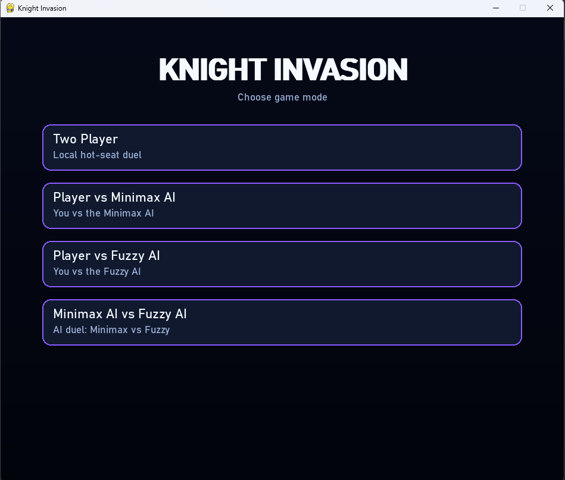
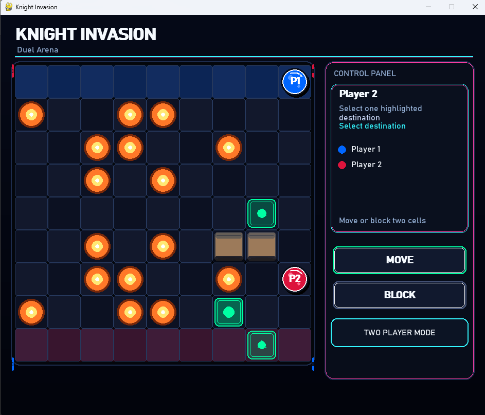
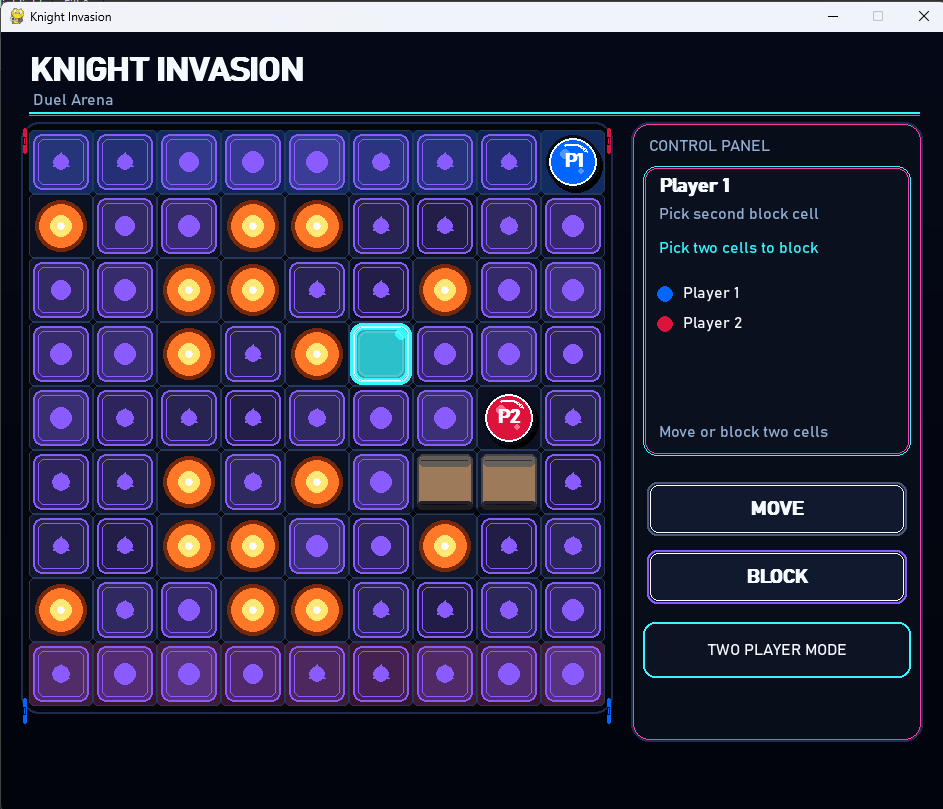
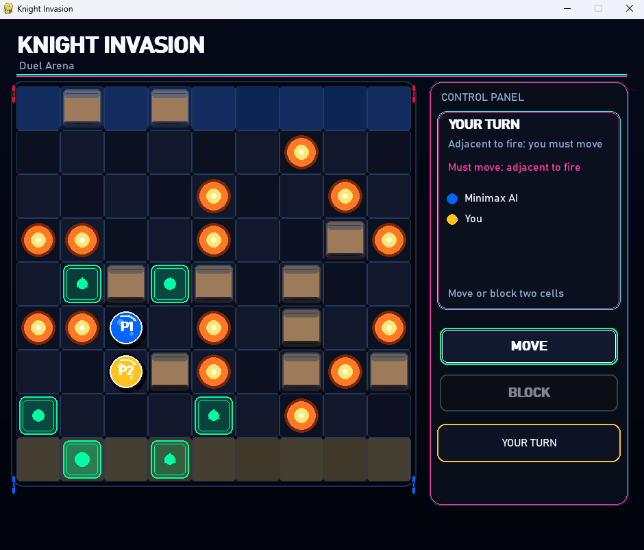
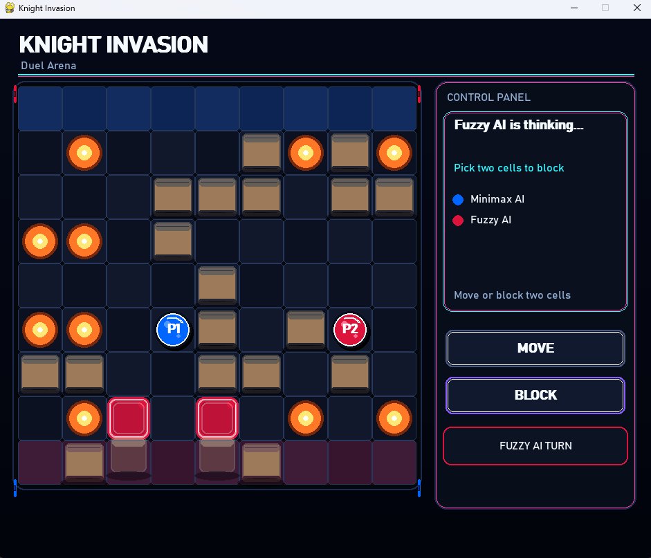
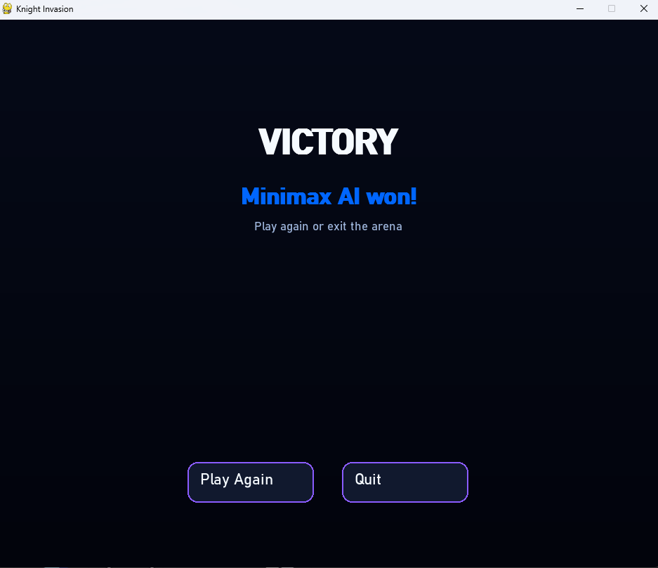

# Knight Invasion - AI Board Game

A two-player AI board game: Minimax vs Fuzzy Logic on a 9×9 grid.


### [Play in Browser](https://kazirifatalmuin.github.io/Knight-Invasion-Game) · [Download for Windows](https://github.com/KaziRifatAlMuin/Knight-Invasion-Game/raw/main/dist/Knight-Invasion.exe) · [Rules](#game-rules) · [AI Agents](#ai-agents) · [Quick Start](#quick-start)


## Contributors:

[Kazi Rifat Al Muin](https://github.com/KaziRifatAlMuin)  ·  Minimax AI

[Dipta Chowdhury](https://github.com/Dipta-38)  ·  Fuzzy AI

---

## Game UI

<div>

<table>
    <tr>
        <td><a href="doc/ss1.png"></a></td>
        <td><a href="doc/ss2.png"></a></td>
        <td><a href="doc/ss3.png"></a></td>
    </tr>
    <tr>
        <td><a href="doc/ss4.png"></a></td>
        <td><a href="doc/ss5.png"></a></td>
        <td><a href="doc/ss6.png"></a></td>
    </tr>
</table>

</div>

---

## Gameplay Video

<div align="center">

<video controls playsinline width="720" poster="doc/ss1.png">
    <source src="https://github.com/KaziRifatAlMuin/Knight-Invasion-Game/blob/main/doc/gameplay.mp4" type="video/mp4">
    <p>View the gameplay video: <a href="https://github.com/KaziRifatAlMuin/Knight-Invasion-Game/blob/main/doc/gameplay.mp4">open on GitHub</a> or <a href="https://github.com/KaziRifatAlMuin/Knight-Invasion-Game/blob/main/doc/gameplay.mp4">download raw</a></p>
</video>

</div>

---

## Overview

**Knight Invasion** is a turn-based tactical board game built for **CSE 3210: Artificial Intelligence Laboratory**. Two knights race across a 9×9 grid - one powered by **Minimax with Alpha-Beta Pruning**, the other by a **Fuzzy Inference System (FIS)**. The board is littered with fire, and every move is a calculated gamble.

The project is a deep study in **adversarial AI**: how optimal tree-search strategies compare to heuristic rule-based systems in a real-time competitive environment. The answer plays out right on the board.

### Key Highlights

- **Dynamic fire hazards** - symmetrically generated, always safe, always threatening
- **Standard chess knight movement** - L-shaped leaps across 9×9
- **Strategic blocking** - place 2 permanent blocks per turn instead of moving
- **BFS path validation** - no block can trap either player; validated every time
- **Dual AI engines** - Minimax (depth 6, iterative deepening) vs Fuzzy Logic (8-rule FIS)
- **Four game modes** - 2P local, Player vs AI, AI vs AI spectator mode
- **Polished Pygame UI** - animated tokens, glowing highlights, particle fire effects

---

## 📁 Project Structure

```
Knight-Invasion-Game/
│
├── main.py                    # Entry point - menus, game loops, animations
│
├── game/
│   ├── board.py               # Pygame renderer - all drawing, UI, animation
│   └── rules.py               # Core game logic - moves, blocks, BFS, state
│
├── agents/
│   ├── minimax_agent.py       # Minimax with alpha-beta pruning + IDS
│   └── fuzzy_agent.py         # Full Fuzzy Inference System (FIS)
│
├── doc/                       # Screenshots & Gameplay
├── dist/
│   └── Knight-Invasion.exe    # Pre-built Windows executable (14.78 MB)
│
└── README.md
```

---

## Quick Start

### Prerequisites

```bash
Python 3.8+
pip install pygame
```

### Run from Source

```bash
# 1. Clone the repository
git clone https://github.com/KaziRifatAlMuin/Knight-Invasion-Game.git

# 2. Enter the project folder
cd Knight-Invasion-Game

# 3. Install dependency
pip install pygame

# 4. Launch the game
python main.py
```

### Windows Executable

No Python required. Download and run directly:

```
dist/Knight-Invasion.exe
Size:   14.78 MB
SHA256: E03424B8EC901E3777F930899A87BF60AE97A84DC5FB41EA9C5F8DA41F18915C
```

> **Security note:** Windows Defender may flag the PyInstaller-packaged `.exe`. This is a known false positive with Pygame bundles. Verify the SHA256 checksum above before running.

---

## Game Rules

### Board & Setup

| Property | Value |
|---|---|
| Grid size | 9 × 9 cells |
| Player 1 (Blue) starts | Row 0, Column 4 → `(0, 4)` |
| Player 2 (Red) starts | Row 8, Column 4 → `(8, 4)` |
| Player 1 goal | Reach **Row 8** (any column) |
| Player 2 goal | Reach **Row 0** (any column) |

### Winning Condition

The **first player** to land their knight on the opponent's starting row wins. There are no draws.

---

### Turn Structure

Each turn, a player must choose **exactly one** of the following actions:

#### Action 1 - Move

Move your knight using **standard chess knight movement**:
- 2 squares in one direction + 1 square perpendicular (L-shape)
- 8 possible directions total

**A move is valid if the destination is:**
- ✅ Inside the 9×9 board
- ✅ Not a fire cell
- ✅ Not a blocked cell
- ✅ Not occupied by the opponent

#### Action 2 - Block

Instead of moving, place **exactly 2 permanent stone blocks** on empty cells.

**A block placement is valid if:**
- ✅ Both cells are empty (no fire, no existing block, no knight)
- ✅ Both cells are different from each other
- ✅ After placement, **both players still have at least one valid path** to their goal row (validated by BFS)
- ✅ The current player is **not adjacent to fire** (fire adjacency forces a move)

> **Important:** If no valid two-cell block combination exists, the player **must move** that turn.

---

### 🔥 Fire Rules

At the start of each game, fire cells are randomly generated with these guarantees:

- Fire is placed **symmetrically** - for every fire cell at `(r, c)`, there is one at `(8-r, c)`
- Fire cells are **permanent** - they never spread or disappear
- Fire never spawns on player starting positions
- Fire generation is **rejected and retried** if it blocks any valid path for either player

**The Fire Adjacency Rule:**
> If your knight is in a cell **directly adjacent** (including diagonals - all 8 surrounding cells) to any fire cell, you **must** move that turn. Blocking is disabled.

This creates high-pressure moments where a knight trapped near fire has no choice but to leap forward.

| Difficulty | Fire Count |
|---|---|
| Easy | 4–8 cells |
| Medium | 8–12 cells |
| Hard | 12–16 cells |

Fire count is always even (symmetrical pairs) and randomly selected within the difficulty range.

---

### 🛡 Path Validity (BFS Enforcement)

Every blocking move is validated using **Breadth-First Search (BFS)**:

1. Temporarily apply the proposed two blocks
2. Run BFS from Player 1's position toward Row 8
3. Run BFS from Player 2's position toward Row 0
4. If **either** BFS finds no path → the block is **rejected**
5. Only moves where **both paths exist** are legal

This ensures neither player can ever be truly trapped - the game always has a resolution path.

---

## 🎮 Game Modes

### ⚔ Two Player (Hot-Seat)

Both players share the same screen and take turns via mouse input. No AI involvement. Pure tactical duel between two human players.

**Controls:**
- Click `MOVE` button → highlights valid knight destinations → click a highlighted cell
- Click `BLOCK` button → highlights valid first-block candidates → click first cell → click second cell
- Click an already-selected first block cell to deselect and re-choose

---

### 🔵 Player vs Minimax AI

You play as **Player 2 (Red Knight)**. The **Minimax AI controls Player 1 (Blue Knight)**.

The AI thinks for up to 0.9 seconds per turn (configurable), using iterative deepening to return the best move found within the time budget. A 700ms UI delay is applied before each AI action for visual clarity.

---

### 🔴 Player vs Fuzzy AI

You play as **Player 2 (Red Knight)**. The **Fuzzy AI controls Player 1 (Red Knight)**.

The Fuzzy agent makes decisions based on linguistic rules - its behavior is more human-like and slightly less predictable than Minimax.

---

### 🤖 Minimax AI vs Fuzzy AI (Spectator)

Both players are controlled by AI. Watch the algorithms duel autonomously. A 700ms delay between AI turns makes the game watchable. ESC exits at any time.

---

## AI Agents

---

### 🔵 Agent: Minimax (Blue Knight)

**Developer:** Kazi Rifat Al Muin &nbsp;|&nbsp; **Algorithm:** Minimax with Alpha-Beta Pruning + Iterative Deepening Search (IDS)

#### How It Works

The Minimax agent builds a **game tree** representing all possible future game states. It assumes the opponent always plays optimally (minimizes the agent's utility) while it tries to maximize it.

```
Root (Agent's turn - MAX)
├── Move A → Opponent's turn (MIN)
│   ├── Opponent Move X → Agent's turn (MAX) → evaluate...
│   └── Opponent Move Y → Agent's turn (MAX) → evaluate...
├── Move B → Opponent's turn (MIN)
│   └── ...
└── Block [C1, C2] → Opponent's turn (MIN)
    └── ...
```

#### Alpha-Beta Pruning

Branches of the tree that cannot possibly influence the final decision are **cut off** before being fully explored:

- **Alpha** (lower bound for MAX): if a node's value is ≥ beta → prune the branch
- **Beta** (upper bound for MIN): if a node's value is ≤ alpha → prune the branch

This reduces the effective branching factor from ~40 to roughly √40 ≈ 6 in well-ordered trees, enabling deeper search.

#### Iterative Deepening

The agent searches depth 1, then 2, then 3... up to depth 6. At each level, it stores the best action found. If the **time budget (0.9s)** expires, it returns the best action from the last completed depth. This guarantees a legal move is always returned.

```python
for search_depth in range(1, self.depth + 1):
    try:
        score, action = minimax(state, agent, search_depth, ..., deadline)
    except SearchTimeout:
        break  # Return best found so far
    if best_score >= WIN_SCORE - 100:
        break  # Early exit on decisive score
```

#### Heuristic Evaluation Function

For non-terminal states, the agent scores positions using four factors:

| Signal | Weight | Description |
|---|---|---|
| BFS distance difference | ×500 | `opp_dist - agent_dist` - most critical signal |
| Row progress difference | ×60 | How far each knight has traveled |
| Mobility difference | ×20 | Number of available moves |
| Block power difference | ×8 | Available first-block candidates |

```python
score = (opp_dist - agent_dist) * 500
      + (agent_progress - opp_progress) * 60
      + (agent_moves - opp_moves) * 20
      + (agent_block_power - opp_block_power) * 8
```

#### Action Generation & Ordering

Candidate actions are **sorted by priority** before evaluation - moves and blocks targeting opponent-reachable cells near the opponent's goal row are evaluated first. This maximizes early alpha-beta cutoffs.

| Parameter | Value |
|---|---|
| Search depth | 6 |
| Time limit | 0.9 seconds |
| Max first-block candidates | 8 |
| Max second-block candidates | 5 |
| AI turn delay (UI) | 700 ms |
| Terminal win score | 1,000,000 |

---

### 🔴 Agent: Fuzzy Logic (Red Knight)

**Developer:** Dipta Chowdhury &nbsp;|&nbsp; **Algorithm:** Full Mamdani Fuzzy Inference System (FIS)

#### How It Works

Instead of exhaustive search, the Fuzzy agent makes decisions by reasoning with **linguistic variables** and **if-then rules** - similar to how a human might think: *"If my opponent is dangerously close to winning and I'm far from my goal, I should definitely block."*

#### Fuzzy Pipeline

```
Crisp Inputs
    │
    ▼
[Fuzzification] ──→ Membership degrees for each linguistic term
    │
    ▼
[Rule Evaluation] ──→ Fire 8 weighted rules using MIN (AND)
    │
    ▼
[Aggregation] ──→ MAX across rules for each output term
    │
    ▼
[Defuzzification] ──→ Centroid method → crisp action value (0–10)
    │
    ▼
Action Decision: must_move / prefer_move / balanced / prefer_block / must_block
```

#### Input Variables & Fuzzy Sets

**Variable 1 - My BFS Distance to Goal**

| Term | Triangular MF (a, b, c) | Meaning |
|---|---|---|
| very_close | (0, 0, 2) | Almost there |
| close | (1, 2, 4) | Near goal |
| medium | (3, 5, 7) | Mid-game |
| far | (5, 7, 8) | Still far |
| very_far | (7, 8, 8) | Far from goal |

**Variable 2 - Opponent BFS Distance to Goal**

| Term | Triangular MF (a, b, c) | Meaning |
|---|---|---|
| critical | (0, 0, 2) | About to win |
| dangerous | (1, 3, 5) | Close |
| moderate | (3, 5, 7) | Mid-board |
| safe | (5, 7, 8) | Far back |
| very_safe | (6, 8, 8) | Very far |

**Variable 3 - Race Advantage** (`opponent_dist - my_dist`)

| Term | Triangular MF (a, b, c) | Meaning |
|---|---|---|
| opponent_ahead_much | (-8, -6, -3) | Opponent winning by a lot |
| opponent_ahead | (-5, -3, -1) | Opponent slightly ahead |
| tied | (-2, 0, 2) | Roughly equal |
| me_ahead | (1, 3, 5) | I'm slightly ahead |
| me_ahead_much | (3, 6, 8) | I'm winning by a lot |

#### Fuzzy Rules

| # | Rule | Weight |
|---|---|---|
| 1 | IF race = opponent_ahead_much → MUST BLOCK | 1.00 |
| 2 | IF race = opponent_ahead → PREFER BLOCK | 0.95 |
| 3 | IF race = tied → BALANCED | 0.70 |
| 4 | IF race = me_ahead → PREFER MOVE | 0.95 |
| 5 | IF race = me_ahead_much → MUST MOVE | 1.00 |
| 6 | IF opponent_dist = critical → MUST BLOCK | 1.00 |
| 7 | IF opponent_dist = dangerous → PREFER BLOCK | 0.90 |
| 8 | IF distance = very_close → MUST MOVE | 1.00 |

#### Defuzzification (Centroid Method)

Output terms are mapped to crisp centers:

| Output Term | Center |
|---|---|
| must_move | 1.0 |
| prefer_move | 3.0 |
| balanced | 5.0 |
| prefer_block | 7.0 |
| must_block | 9.0 |

```
crisp_value = Σ(strength × center) / Σ(strength)
```

The crisp value maps to a final action:
- `0–2.5` → Must Move
- `2.5–4.5` → Prefer Move
- `4.5–6.5` → Balanced (contextual)
- `6.5–8.5` → Prefer Block
- `8.5–10` → Must Block

#### Additional Heuristics

The Fuzzy agent also uses:
- **Best-block search** - evaluates opponent's reachable cells and ranks block pairs by maximum BFS disruption
- **Loop detection** - if the agent revisits the same 2 positions within 4 turns, it forces a novel move
- **Safe-move filtering** - prefers cells not adjacent to fire; only accepts fire-adjacent moves when no safe option exists

---

## 🛠 Technical Architecture

### `game/rules.py` - Core Logic

| Function | Purpose |
|---|---|
| `get_knight_moves()` | Returns all valid L-moves from a position |
| `is_adjacent_to_fire()` | Checks Chebyshev distance = 1 to any fire cell |
| `has_valid_path()` | BFS from position to target row |
| `can_place_two_blocks()` | Validates a block pair with dual-BFS check |
| `exists_valid_block()` | O(n²) scan - checks if any valid block pair exists |
| `generate_symmetric_fire_safe()` | Generates mirrored fire cells, retries until both paths exist |
| `GameState` | Mutable game state: positions, blocks, fires |

### `game/board.py` - Renderer

All rendering is handled by the `Board` class using Pygame surfaces and drawing primitives:

| Feature | Implementation |
|---|---|
| Cell grid | Alternating dark/light with rounded corners |
| Goal row highlight | Color-pulsed overlay (sin-wave alpha) |
| Fire animation | Layered circles with time-based radius oscillation |
| Knight tokens | Radial gradient + shine highlight + arc glare |
| Stone blocks | Layered rect with highlight band, shadow band, and bevel |
| Move highlights | Pulsing fill + triangle arrow indicator |
| Block highlights | Purple-tinted pulsing fill |
| Token movement | Linear interpolation over 24–28 frames |
| Block placement | Drop animation from board edge (top or bottom) |

### `main.py` - Game Loop

Four independent game loop functions, one per mode:
- `main_game_2player()` - pure human input
- `main_game_player_vs_minimax()` - AI runs on player 1's turn with `ai_timer` delay
- `main_game_player_vs_fuzzy()` - same pattern for Fuzzy agent
- `main_game_minimax_vs_fuzzy()` - both turns auto-execute

All loops share:
- `animate_move()` - interpolates token position over N frames
- `animate_block()` - drop animation for stone blocks
- `SwappedStateView` - wraps state so Fuzzy agent always reasons as "player 1"

---

## 📊 AI Comparison

| Property | Minimax | Fuzzy Logic |
|---|---|---|
| **Approach** | Optimal adversarial search | Rule-based heuristic inference |
| **Completeness** | Complete (within time budget) | Incomplete (rule coverage) |
| **Optimality** | Near-optimal at depth 6 | Heuristic - no guarantee |
| **Decision basis** | Game tree evaluation | Linguistic membership degrees |
| **Blocking strategy** | Evaluated in full search tree | BFS-disruption ranking |
| **Responds to fire** | Via heuristic penalty | Via explicit loop detection |
| **Speed** | Time-bounded (0.9s) | Near-instant |
| **Explainability** | Low - black box search | High - rules are human-readable |
| **Strength vs. opponent** | Generally stronger | More unpredictable |

---

## 📦 Dependencies

| Package | Version | Purpose |
|---|---|---|
| `pygame` | 2.x | Rendering, input, animation |
| `collections.deque` | stdlib | BFS queue |
| `random` | stdlib | Fire generation, difficulty selection |
| `copy` | stdlib | `GameState.clone()` deep copy |
| `math` | stdlib | Sin-wave animations, alpha-beta ±∞ |
| `time` | stdlib | Minimax deadline enforcement |

---

## 👥 Contributors

<table>
<tr>
<td align="center">
<b>Kazi Rifat Al Muin</b><br/>
Roll: 2107042<br/>
<i>Minimax AI Agent</i><br/>
<a href="https://github.com/KaziRifatAlMuin">@KaziRifatAlMuin</a>
</td>
<td align="center">
<b>Dipta Chowdhury</b><br/>
Roll: 2107038<br/>
<i>Fuzzy AI Agent</i><br/>
<a href="https://github.com/Dipta-38">@Dipta-38</a>
</td>
</tr>
</table>

---

## 📜 License

This project was developed for academic purposes under **CSE 3210: Artificial Intelligence Laboratory** at Khulna University of Engineering & Technology (KUET). It is intended for educational and non-commercial use only.